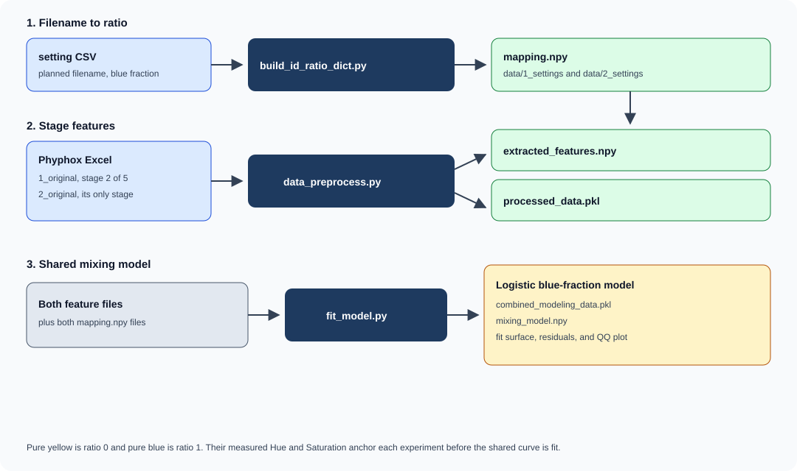
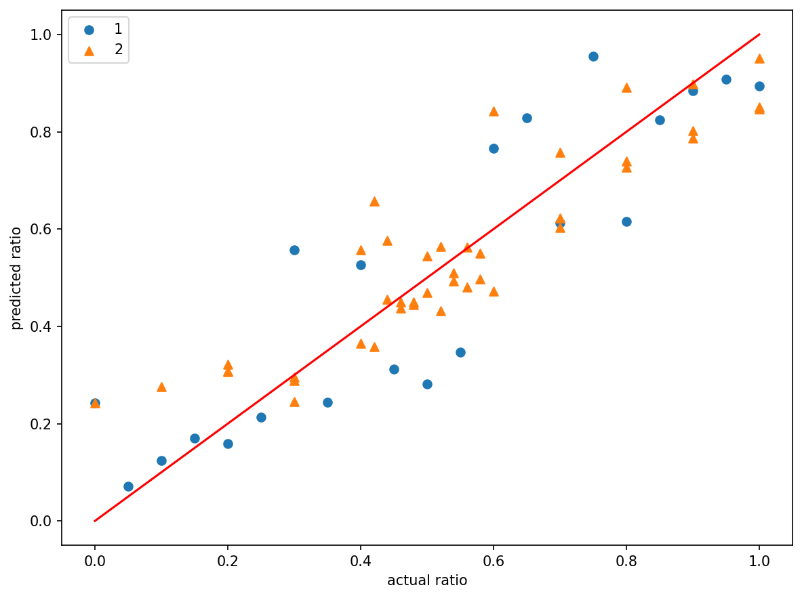
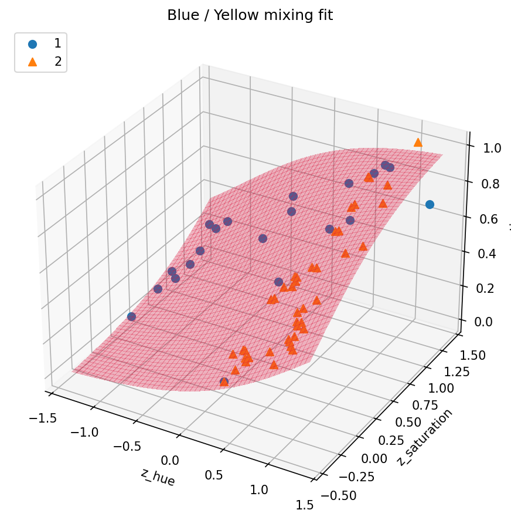
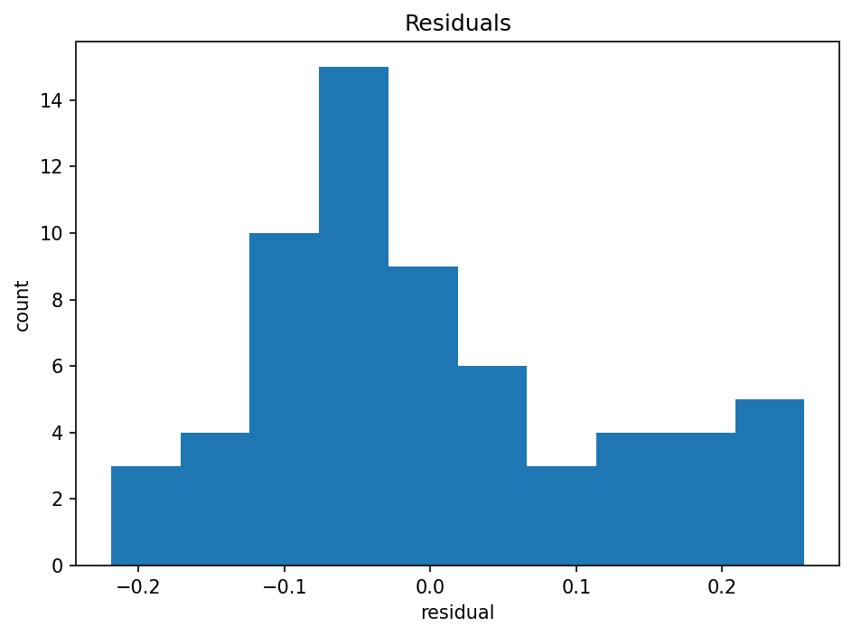
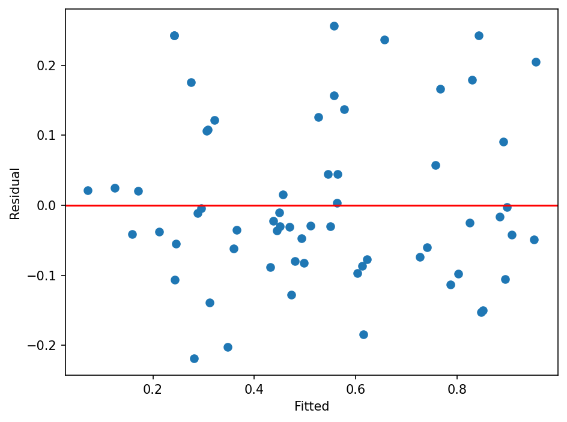

# CalcRatio

Software for the hardware pigment-mixing tests. Phyphox records the color of blue and yellow solutions. CalcRatio turns those recordings into a blue volume fraction that can be compared across batches.

Two phyphox experiments mixed blue and yellow stocks in known volume ratios. The stocks did not start at the same concentration, and the camera exposure was not the same, so one plane fitted to raw Hue and Saturation does not transfer from one experiment to the other. CalcRatio rescales each batch by its own pure yellow and pure blue, then fits one logistic for both batches.

## Features

**Filename to ratio** (`scripts/build_id_ratio_dict.py`). The prepared blue fraction is written in a sample sheet, not in the phyphox file. This script reads the sheet and saves a map from the planned filename to `true_blue_fraction`. Later steps look up a recording by that filename.

**Stage features** (`scripts/data_preprocess.py`). A phyphox export is a time series, not one color. The script splits the series into plateaus on Hue, averages each plateau, and joins the requested stage to the blue fraction. Hue is a circular mean. Saturation and Value are arithmetic means. Camera settings are copied from the first row of the file.

**Shared mixing curve** (`scripts/fit_model.py`). Raw Hue and Saturation change when the stock concentration or the exposure changes. This script treats pure yellow as ratio 0 and pure blue as ratio 1, writes each sample as its position between those two readings (`z_hue`, `z_saturation`), and fits one logistic of those two coordinates. The same script also fits the older plane, `ratio ~ Hue + Saturation`, so the two equations can be compared on the same rows. It then prints the fit and opens the residual and prediction plots.

## Architecture



**Figure 1.** Stage features from both phyphox experiments are rescaled by each batch's pure yellow and pure blue, then fit with one logistic.

Experiment 1 keeps five stages and the model uses stage 2. Experiment 2 has one stage and uses that stage. A new batch does not need a new set of coefficients. It needs its own pure yellow and pure blue, measured under the same conditions, so the sample can be placed on the same `z_hue` and `z_saturation` axes.

## Install

Python 3.12 or newer, as declared in `pyproject.toml`. Package versions are not pinned.

| Package | Used for |
| --- | --- |
| NumPy | Arrays, circular means, and `.npy` dictionaries |
| pandas | Tables, the sample-sheet CSV, and phyphox Excel files |
| openpyxl | Reading `.xlsx` workbooks through pandas |
| Matplotlib | Fit surface, residual plots, predicted-versus-actual plot, and QQ plot |
| SciPy | Logistic least squares and the t distribution for coefficient tests |
| statsmodels | Linear Hue–Saturation baseline and the residual QQ plot |

Phyphox is the phone app that writes the Excel files. It is not installed by this package.

From `CalcRatio/`:

```powershell
python -m pip install numpy pandas openpyxl matplotlib scipy statsmodels
```

## Usage

Defaults are resolved from the `CalcRatio` folder, so the working directory does not matter. The commands below are written as if the shell is already in `CalcRatio/`.

The two filename-to-ratio maps used by the published fit are already saved:

- `data/1_settings/mapping.npy`
- `data/2_settings/mapping.npy`

`build_id_ratio_dict.py` rebuilds a map from a sample sheet. Its default input is `data/2_settings/setting.csv`. That sheet is not in this folder. Pass `-i` if the sheet lives somewhere else. The expected columns are `planned_filename` and `true_blue_fraction`.

Experiment 2 has one stage. The defaults match it:

```powershell
python scripts/data_preprocess.py
```

Experiment 1 has five recorded stages. Keep stage 2:

```powershell
python scripts/data_preprocess.py -i data/1_original -o data/1_processed --dict_file data/1_settings/mapping.npy -n 5 --key_stage 2
```

Fit both experiments with one logistic:

```powershell
python scripts/fit_model.py
```

The fit writes `data/2_processed/combined_modeling_data.pkl` and `data/2_processed/mixing_model.npy`. The plots open on screen. `fit_model.py` does not save the image files. The copies in `figures/` are the ones used for the published fit.

## Results

On 63 samples the shared logistic has `R-squared = 0.801` and `RMSE = 0.118`. The raw Hue–Saturation plane on the same rows has `R-squared = 0.638`. Experiment 1 contributes 21 samples and experiment 2 contributes 42. Residual degrees of freedom for the three-coefficient logistic are 60. The intercept and both color coefficients have p-values below 0.001. The largest absolute residual is 0.257. Residual skew is 0.57 and kurtosis is −0.33.

The fitted curve is

```text
z_hue        = (Hue - Yellow_Hue) / (Blue_Hue - Yellow_Hue)
z_saturation = (Saturation - Yellow_Saturation) / (Blue_Saturation - Yellow_Saturation)
ratio        = 1 / (1 + exp(-(-1.1397 + 1.4533 * z_hue + 1.8247 * z_saturation)))
```

| Fit | n | R² | RMSE |
| --- | ---: | ---: | ---: |
| Experiment 1, its own Hue–Saturation plane | 21 | 0.805 | 0.134 |
| Experiment 2, its own Hue–Saturation plane | 42 | 0.856 | 0.091 |
| Both batches, one Hue–Saturation plane | 63 | 0.638 | 0.159 |
| Shared logistic, both batches | 63 | 0.801 | 0.118 |
| Experiment 1 under that logistic | 21 | 0.781 | 0.142 |
| Experiment 2 under that logistic | 42 | 0.815 | 0.103 |

Inside one batch, a plane fitted to that batch alone is a little tighter. That plane belongs to one stock pair and one camera setup. The shared logistic is the model that accepts a new pair after that pair's pure yellow and pure blue have been measured.

| Experiment | Yellow Hue | Yellow Saturation | Blue Hue | Blue Saturation |
| --- | ---: | ---: | ---: | ---: |
| 1 | 177.788° | 0.791 | 215.408° | 0.990 |
| 2 | 107.502° | 0.272 | 210.154° | 0.586 |

Experiment 1's pure yellow on stage 2 is 177.8°, while samples with 5–25% blue sit near 126–139°. The pure-yellow reading is not at the yellow end of that stage, so some `z_hue` values fall below 0. Stage 1 of the same recordings tracks ratio more closely (correlation about 0.94) than stage 2 (about 0.82). The published fit uses the requested stage 2.



**Figure 2.** Predicted fraction against the prepared fraction (n = 63). Points on the red line agree with the shared curve. Scatter is larger for experiment 1, matching its RMSE of 0.142.



**Figure 3.** The shared logistic in `z_hue` and `z_saturation`. Experiment 2 sits between the yellow and blue endpoints. Experiment 1 extends below `z_hue = 0` because its stage-2 pure yellow is not the yellow extreme of that series.



**Figure 4.** Residuals (fitted ratio minus measured ratio) mostly fall within about ±0.2. The longer positive tail means the fit is high on some samples. Residual skew is 0.57.



**Figure 5.** Residuals stay around zero from low to high fitted fractions, without a strong funnel.


**Figure 6.** The normal QQ plot shows the same mild right skew as the histogram: the upper tail leaves the reference line. Kurtosis is −0.33.

## References and third-party tools

No paper is cited in this code. The blue fraction is the prepared volume ratio of the two pigment stocks. Phyphox is the third-party app that records Hue, Saturation, Value, and the camera settings.

Python libraries are the packages in the install table: NumPy, pandas, openpyxl, Matplotlib, SciPy, and statsmodels.
